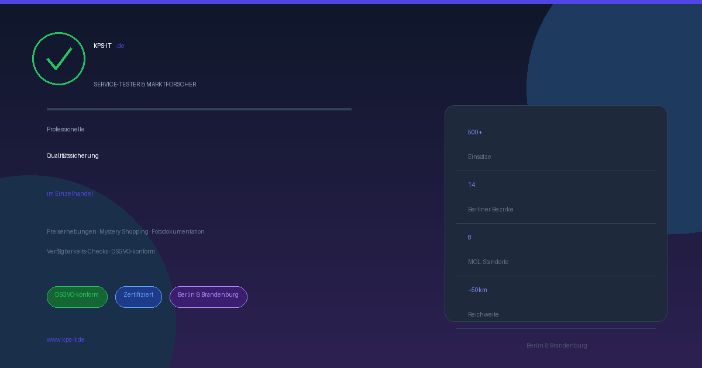

<div align="center">


# KPS-IT.de – Service-Tester & Marktforscher

**Professionelles Web-Portal für Marktforschung und Qualitätssicherung**

[](https://php.net)
[](https://developer.mozilla.org/en-US/docs/Web/HTML)
[](https://developer.mozilla.org/en-US/docs/Web/CSS)
[](https://developer.mozilla.org/en-US/docs/Web/JavaScript)
[](https://mysql.com)
[](https://web.dev/progressive-web-apps/)
[](LICENSE)

*Digitale Visitenkarte und Legitimationsseite für zertifizierte Service-Tester und Marktforscher im Raum Berlin-Brandenburg*

</div>

---

## 📋 Inhaltsverzeichnis

- [📸 Screenshots](#-screenshots)
- [🎯 Projektübersicht](#-projektübersicht)
- [✨ Features im Überblick](#-features-im-überblick)
- [📄 Seiten & Navigation](#-seiten--navigation)
- [🔧 Systeme & Module](#-systeme--module)
  - [Frontend-System](#1-frontend-system)
  - [Kontakt & Kommunikation](#2-kontakt--kommunikationssystem)
  - [Admin-Dashboard](#3-admin-dashboard-system)
  - [Auftragsverfolgung](#4-auftragsverfolgungssystem)
  - [Einsatznachweis](#5-einsatznachweissystem)
  - [Verfügbarkeitskalender & Buchungen](#6-verfügbarkeitskalender--buchungssystem)
  - [Statistik & Analytics](#7-statistik--analytics-system)
  - [Institutsverwaltung](#8-institutsverwaltung)
  - [PWA & Offline-Unterstützung](#9-pwa--offline-unterstützung)
- [⚙️ Funktionsverzeichnis](#️-funktionsverzeichnis)
- [🛠️ Technologie-Stack](#️-technologie-stack)
- [📁 Dateiverzeichnis](#-dateiverzeichnis)
- [🔒 Sicherheitsfeatures](#-sicherheitsfeatures)
- [🚀 Installation & Setup](#-installation--setup)
- [⚙️ Konfiguration](#️-konfiguration)
- [🗄️ Datenbank](#️-datenbank)
- [📡 API-Referenz](#-api-referenz)
- [🌐 Apache-Konfiguration](#-apache-konfiguration)
- [📱 Progressive Web App](#-progressive-web-app)

---

## 📸 Screenshots

<div align="center">

### 🏠 Startseite – Hero-Bereich


*Animierter Hero-Bereich mit Floating-Orbs, Grid-Hintergrund und interaktiver Scroll-Navigation*

</div>

### Seitenübersicht

| Seite | Beschreibung | Vorschau |
|-------|--------------|----------|
| **Startseite** (`index.html`) | Landing Page mit allen Leistungen, Statistiken und Kontaktformular | Dark-Mode, Glassmorphism |
| **Einsatznachweis** (`einsatznachweis.html`) | Digitales Formular zur Erfassung von Arbeitseinsätzen | Formular mit QR-Code |
| **Kalender** (`kalender.html`) | Interaktiver Verfügbarkeitskalender mit Buchungsanfragen | Monatliche Kalenderansicht |
| **Auftragsverfolgung** (`tracking.html`) | Öffentliche Statusabfrage für Aufträge | Status-Badge, Fortschrittsanzeige |
| **Institute** (`institute.html`) | Verzeichnis kooperierender Forschungsinstitute | Karten-Grid mit Filterfunktion |
| **Admin-Panel** (`admin.php`) | Passwortgeschütztes Verwaltungs-Dashboard | Multi-Modul-Interface |

---

## 🎯 Projektübersicht

**KPS-IT.de** ist ein professionelles Web-Portal für einen zertifizierten Service-Tester und Marktforscher im Raum Berlin-Brandenburg. Das Portal dient als:

- 📋 **Digitale Visitenkarte** mit verifizierbarem QR-Code-Dienstausweis
- 🏪 **Service-Showcase** für alle angebotenen Marktforschungsleistungen
- 🛠️ **Operatives Werkzeug** für Auftragserfassung, Einsatznachweise und Buchungsverwaltung
- 🔐 **Legitimationsnachweis** gegenüber Auftraggebern und Forschungsinstituten

### Angebotene Dienstleistungen

| Dienst | Beschreibung |
|--------|--------------|
| 📊 **Preiserhebungen** | Preiserfassung im Einzelhandel und Vergleichsanalysen |
| 🕵️ **Service-Tests** (Mystery Shopping) | Verdeckte Qualitätsprüfungen im Kundendienst |
| 📷 **Fotodokumentation** | Visuelle Produkt- und Regaldokumentation |
| 📦 **Verfügbarkeits-Checks** | Out-of-Stock (OOS)-Analysen und Regalverfügbarkeit |
| 📝 **Berichterstellung** | Professionelle Marktforschungsberichte |
| 🎓 **Qualifikationsnachweise** | Digitaler Dienstausweis mit Zertifizierungsinfo |

---

## ✨ Features im Überblick

### 🎨 Design & Benutzeroberfläche

| Feature | Beschreibung |
|---------|--------------|
| **Dark Mode Design** | Tiefes Marine/Schwarz mit Indigo-Akzenten (`#080c14`, `#6366f1`) |
| **Glassmorphism** | Frosted-Glass-Effekte auf Header, Karten und Modals |
| **Animierter Hero-Bereich** | Floating Orbs, animiertes Grid, Scroll-Indikator |
| **Responsive Layout** | Mobile-First, getestet auf allen Gerätegrößen |
| **Hover-Animationen** | Glow-Effekte und Transformationen auf interaktiven Elementen |
| **Dark/Light-Mode-Toggle** | Umschaltbares Farbschema mit localStorage-Persistenz |
| **Preloader** | Kurze Ladeanimation beim ersten Seitenaufruf |
| **Scroll-Animationen** | Elemente blenden beim Einrollen in den Viewport ein |
| **Scroll-Fortschrittsbalken** | Visueller Scroll-Tiefenindikator am oberen Seitenrand |

### 🧭 Navigation & Interaktion

| Feature | Beschreibung |
|---------|--------------|
| **Mobile Hamburger-Menü** | Animiertes Menü für Smartphones und Tablets |
| **Sticky Header** | Navigation bleibt beim Scrollen sichtbar |
| **Aktive Navigation** | Aktueller Abschnitt wird im Menü hervorgehoben (Intersection Observer) |
| **Smooth Scrolling** | Weiches Gleiten zu Seitenabschnitten |
| **Back-to-Top-Button** | Erscheint nach 300px Scroll-Distanz |
| **Tastatur-Navigation** | Vollständige Zugänglichkeit per Tastatur |

### 📊 Datenvisualisierung

| Feature | Beschreibung |
|---------|--------------|
| **Animierte Statistik-Counter** | Zahlen zählen beim Einblenden hoch |
| **Skill-Radardiagramm** | Kompetenzvisualisierung als Netzdiagramm |
| **Skill-Balkendiagramme** | Fähigkeitslevel-Indikatoren mit Animation |
| **Testimonials-Slider** | Automatisch scrollende Kundenstimmen |
| **Interaktive Leaflet-Karte** | Servicegebiet Berlin-Brandenburg auf OpenStreetMap |

### 🆔 Digitaler Dienstausweis

| Feature | Beschreibung |
|---------|--------------|
| **QR-Code-Generator** | Automatisch generierter QR-Code mit Profillink |
| **Druckfunktion** | Optimiertes Drucklayout für den Ausweis |
| **Gültigkeitsdaten** | Ausweisinhaber, Nummer und Gültigkeitszeitraum |
| **Institutszugehörigkeit** | Zugeordnete Forschungsinstitute |

### 📬 Kontaktformular

| Feature | Beschreibung |
|---------|--------------|
| **CSRF-Schutz** | Token-basierter Schutz gegen Cross-Site-Angriffe |
| **Honeypot-Feld** | Unsichtbares Feld zur Bot-Erkennung |
| **Rate-Limiting** | Max. 5 Anfragen pro IP in 10 Minuten |
| **Spam-Filter** | Erkennt URLs und Spam-Muster in Nachrichten |
| **Input-Sanitisierung** | Alle Eingaben werden bereinigt und validiert |
| **Bestätigungs-E-Mail** | Automatische Antwort an den Absender |
| **Datenbankpersistenz** | Speicherung in MySQL oder JSON-Fallback |

---

## 📄 Seiten & Navigation

```
kps-it.de/
├── index.html               ← Hauptseite (Landing Page)
│   ├── #home                ← Hero-Bereich
│   ├── #leistungen          ← 6 Servicekarten
│   ├── #einsatzgebiete      ← Einsatzgebiete & Karte
│   ├── #statistiken         ← Animierte Kennzahlen
│   ├── #dienstausweis       ← Digitaler QR-Ausweis
│   ├── #referenzen          ← Kundenstimmen
│   ├── #ueber-mich          ← Über den Betreiber
│   └── #kontakt             ← Kontaktformular
│
├── einsatznachweis.html     ← Digitaler Einsatznachweis
├── kalender.html            ← Verfügbarkeitskalender & Buchungen
├── tracking.html            ← Öffentliche Auftragsverfolgung
├── institute.html           ← Kooperationspartner-Verzeichnis
│
├── preiserhebungen.html     ← Leistungsdetails: Preiserfassung
├── service-tests.html       ← Leistungsdetails: Mystery Shopping
├── berichterstellung.html   ← Leistungsdetails: Berichterstellung
├── fotodokumentation.html   ← Leistungsdetails: Fotodokumentation
├── verfuegbarkeits-checks.html ← Leistungsdetails: OOS-Analysen
├── dsgvo-compliance.html    ← DSGVO-Konformitätsinformationen
├── ueber-mich.html          ← Detailliertes Profil
│
├── datenschutz.html         ← Datenschutzerklärung (DSGVO)
├── impressum.html           ← Rechtliches Impressum
└── offline.html             ← PWA-Offline-Fallbackseite

Backend:
├── admin.php                ← Admin-Dashboard (passwortgeschützt)
├── statistik.php            ← Statistik-Dashboard
├── send.php                 ← Kontaktformular-Handler
├── tracking-api.php         ← Auftrags-API
├── nachweis-api.php         ← Einsatznachweis-API
├── calendar-api.php         ← Kalender-API
├── institutes-api.php       ← Instituts-API
├── stats-api.php            ← Analytics-API
└── db.php                   ← Datenbank-Abstraktionsschicht
```

---

## 🔧 Systeme & Module

### 1. Frontend-System

Das Frontend basiert auf Vanilla JavaScript (ES6+) ohne externe Frameworks. Es ist vollständig modular aufgebaut:

| Modul | Datei | Beschreibung |
|-------|-------|--------------|
| **Kern-JavaScript** | `main.js` | Navigation, Animationen, QR-Code, Counter |
| **Erweiterte Features** | `features2.js` | Radardiagramm, Slider, Karte, Theme-Toggle |
| **Structured Data** | `schema.js` | Schema.org JSON-LD für SEO |
| **Internationalisierung** | `i18n.js` | Mehrsprachigkeits-Unterstützung |
| **Karte** | `kps-map.js` | Leaflet-Integration mit Servicegebiet |
| **Cookie-Banner** | `cookie-banner.js` | DSGVO-konformes Cookie-Consent |
| **Analytics-Tracker** | `tracker.js` | Datenschutzkonformes Besuchertracking |
| **QR-Code-Lib** | `qrcode.min.js` | Lokale QR-Code-Bibliothek (keine CDN) |

### 2. Kontakt- & Kommunikationssystem

**Datei:** `send.php`

Das Kontaktformular-Backend verarbeitet eingehende Nachrichten sicher:

```
Eingehende Anfrage
    │
    ▼
CSRF-Token-Validierung ──► Fehler → 403
    │
    ▼
Honeypot-Prüfung ──────► Bot erkannt → Stilles Verwerfen
    │
    ▼
Rate-Limit-Check ──────► Limit überschritten → 429
    │
    ▼
Input-Sanitisierung
    │
    ▼
Spam-Filter ────────────► Spam erkannt → Ablehnen
    │
    ▼
Datenbankpersistenz (MySQL / JSON-Fallback)
    │
    ▼
E-Mail-Versand (Empfänger + Bestätigungs-E-Mail)
    │
    ▼
JSON-Antwort an Frontend
```

### 3. Admin-Dashboard-System

**Datei:** `admin.php` | **Zugang:** Passwortgeschützt

Das Admin-Dashboard bietet folgende **8 Module**:

| Modul | Funktion |
|-------|----------|
| 📊 **Dashboard** | KPI-Übersicht: Nachrichten, Buchungen, Aufträge, Seitenaufrufe |
| 📧 **Nachrichten** | Kontaktanfragen anzeigen, als gelesen markieren, löschen |
| 📅 **Kalender** | Verfügbarkeitstage setzen (verfügbar/gebucht/nicht verfügbar) |
| 📋 **Buchungen** | Buchungsanfragen einsehen und verwalten |
| 📦 **Aufträge** | Aufträge erstellen, bearbeiten, Status aktualisieren, löschen |
| 🏢 **Institute** | Kooperationspartner verwalten (CRUD) |
| 📝 **Nachweise** | Einsatznachweise einsehen und verwalten |
| 📈 **Statistiken** | Website-Analytics einsehen |

**Sicherheit:**
- Brute-Force-Schutz: 5 Fehlversuche → 15 Minuten Sperrung
- Session-Timeout: 60 Minuten Inaktivität
- Activity-Logging für alle Admin-Aktionen

### 4. Auftragsverfolgungssystem

**Dateien:** `tracking.html`, `tracking-api.php`

Ermöglicht Kunden die **öffentliche Statusabfrage** ihrer Aufträge:

| Feld | Beschreibung |
|------|--------------|
| **Auftrags-ID** | Format: `AUF-XXXXXXXXXX` |
| **Zugangscode** | 8-stelliger Code für den Kunden |
| **Status** | Aktiv / Abgeschlossen / Pausiert |
| **Fortschritt** | Prozentanzeige (0–100%) |
| **Notizen** | Sichtbare Kundenhinweise |
| **Erledigungsdatum** | Geplantes Fertigstellungsdatum |

### 5. Einsatznachweissystem

**Dateien:** `einsatznachweis.html`, `nachweis-api.php`

Digitale Erfassung und Verwaltung von Arbeitseinsätzen:

| Feld | Typ | Beschreibung |
|------|-----|--------------|
| **Mitarbeitername** | Text | Name des Mitarbeiters |
| **Auftrags-ID** | Text | Zugehöriger Auftrag |
| **Datum & Uhrzeit** | DateTime | Einsatzzeitpunkt |
| **Filiale/Standort** | Text | Einsatzort |
| **Tätigkeitsart** | Auswahl | Preischeck, Mystery Shop, etc. |
| **Dauer** | Zahl | Einsatzdauer in Minuten |
| **Forschungsinstitut** | Auswahl | Zugeordnetes Institut |
| **Notizen** | Textarea | Freitext-Bemerkungen |

### 6. Verfügbarkeitskalender- & Buchungssystem

**Dateien:** `kalender.html`, `calendar-api.php`

| Feature | Beschreibung |
|---------|--------------|
| **Monatliche Kalenderansicht** | Navigation zwischen Monaten |
| **Verfügbarkeitsstatus** | Farbcodiert: verfügbar (grün), gebucht (gelb), nicht verfügbar (rot), vergangen (grau) |
| **Wochenend-Automatik** | Wochenenden standardmäßig als verfügbar markiert |
| **Buchungsanfrage-Formular** | Kunden können direkt buchen |
| **Buchungsverfolgung** | Admin sieht alle Buchungsanfragen |

### 7. Statistik- & Analytics-System

**Dateien:** `stats-api.php`, `statistik.php`, `tracker.js`

DSGVO-konformes Besuchertracking:

| Metrik | Beschreibung |
|--------|--------------|
| **Seitenaufrufe** | Täglich aggregierte Aufrufzahlen |
| **Beliebte Seiten** | Ranking der meistbesuchten Seiten |
| **Referrer** | Herkunftsquellen der Besucher |
| **Gerätetyp** | Mobile, Tablet, Desktop |
| **Datenspeicherung** | Keine IP-Speicherung, gehashte Besucher-IDs, 90-Tage-Retention |

### 8. Institutsverwaltung

**Dateien:** `institute.html`, `institutes-api.php`

Vollständiges CRUD-System für kooperierende Forschungsinstitute:

| Feld | Beschreibung |
|------|--------------|
| **Name** | Institutionsname |
| **Kategorie** | Institutionstyp (z.B. Marktforschung, Prüfinstitut) |
| **Kontaktdaten** | E-Mail, Telefon, Website |
| **Priorität** | Reihenfolge in der Anzeige |
| **Tags** | Suchbegriffe und Schlagwörter |
| **Status** | Aktiv / Inaktiv |

### 9. PWA & Offline-Unterstützung

**Dateien:** `manifest.json`, `sw.js`

| Feature | Beschreibung |
|---------|--------------|
| **Installierbare App** | "Zum Startbildschirm hinzufügen" auf iOS/Android |
| **Service Worker** | Offline-Caching ausgewählter Ressourcen |
| **App-Shortcuts** | Direktzugriff auf Einsatznachweis und Institute |
| **Standalone-Modus** | Läuft ohne Browser-UI wie eine native App |
| **App-Icons** | Mehrere Größen (72px–512px) für alle Geräte |

---

## ⚙️ Funktionsverzeichnis

### `main.js` – Kern-JavaScript

| Funktion | Beschreibung |
|----------|--------------|
| `initPreloader()` | Ladeanimation beim ersten Seitenaufruf |
| `initMobileMenu()` | Hamburger-Menü-Toggle mit Animation |
| `initStickyHeader()` | Header-Effekte beim Scrollen |
| `initActiveNavigation()` | Intersection Observer für aktive Nav-Links |
| `initSmoothScroll()` | Weiches Scrollen zu Anker-Links |
| `animateCounter(el, target)` | Zähler-Animation für Statistiken |
| `initCounters()` | Scroll-Observer für alle Counter |
| `generateQrCode()` | QR-Code aus Profillink generieren |
| `fetchCsrfToken()` | CSRF-Token vom Server holen |
| `initContactForm()` | Formular-Validierung und AJAX-Submit |
| `initBackToTop()` | Back-to-Top-Button-Sichtbarkeit |

### `features2.js` – Erweiterte Features

| Funktion | Beschreibung |
|----------|--------------|
| `initScrollProgress()` | Scroll-Tiefenindikator aktualisieren |
| `initDarkModeToggle()` | Theme-Wechsler mit localStorage |
| `initSkillBars()` | Skill-Balken-Animation |
| `initRadarChart()` | Kompetenz-Radardiagramm rendern |
| `initTestimonialsSlider()` | Automatischer Testimonials-Carousel |
| `initLeafletMap()` | OpenStreetMap-Karte initialisieren |
| `initPWAInstallBanner()` | PWA-Install-Prompt erkennen |
| `initScrollReveal()` | Elemente beim Scrollen einblenden |

### `send.php` – Kontaktformular-Handler

| Funktion | Beschreibung |
|----------|--------------|
| `generateCsrfToken()` | CSRF-Token erstellen und in Session speichern |
| `validateCsrfToken($token)` | Token gegen Session-Wert prüfen |
| `checkRateLimit($ip)` | IP-basiertes Rate-Limiting (5/10 min) |
| `sanitizeInput($input)` | XSS-Bereinigung und Trim |
| `validateEmail($email)` | E-Mail-Formatprüfung |
| `detectSpam($text)` | URL- und Spam-Muster-Erkennung |
| `sendConfirmationEmail($to, $name)` | Bestätigungs-E-Mail versenden |
| `dbSaveMessage($data)` | Nachricht in DB/JSON speichern |

### `db.php` – Datenbank-Abstraktionsschicht

| Funktion | Bereich | Beschreibung |
|----------|---------|--------------|
| `getDB()` | Core | PDO-Singleton-Verbindung |
| `dbSaveMessage($data)` | Nachrichten | Neue Nachricht speichern |
| `dbLoadMessages()` | Nachrichten | Alle Nachrichten laden |
| `dbDeleteMessage($id)` | Nachrichten | Nachricht löschen |
| `dbMarkMessageRead($id)` | Nachrichten | Als gelesen markieren |
| `dbSaveOrder($data)` | Aufträge | Neuen Auftrag anlegen |
| `dbLoadOrders()` | Aufträge | Alle Aufträge laden |
| `dbUpdateOrder($id, $data)` | Aufträge | Auftrag aktualisieren |
| `dbDeleteOrder($id)` | Aufträge | Auftrag löschen |
| `dbLoadBookings()` | Buchungen | Alle Buchungen laden |
| `dbDeleteBooking($id)` | Buchungen | Buchung löschen |
| `dbLoadInstitutes()` | Institute | Institute laden |
| `dbSaveInstitute($data)` | Institute | Institut anlegen/aktualisieren |
| `dbDeleteInstitute($id)` | Institute | Institut löschen |
| `dbSaveNachweis($data)` | Nachweise | Einsatznachweis speichern |
| `dbLoadNachweise()` | Nachweise | Alle Nachweise laden |
| `dbDeleteNachweis($id)` | Nachweise | Nachweis löschen |
| `jsonLoad($file)` | JSON | JSON-Datei laden (Fallback) |
| `jsonSave($file, $data)` | JSON | JSON-Datei schreiben |
| `jsonAppend($file, $item)` | JSON | Eintrag hinzufügen |
| `jsonDelete($file, $id)` | JSON | Eintrag löschen |
| `jsonUpdate($file, $id, $data)` | JSON | Eintrag aktualisieren |
| `jsonUpsert($file, $id, $data)` | JSON | Insert-or-Update |

### `kps-map.js` – Karten-Integration

| Funktion | Beschreibung |
|----------|--------------|
| `initMap(containerId)` | Leaflet-Karte im Container initialisieren |
| `addServiceArea()` | Servicegebiet Berlin-Brandenburg hervorheben |
| `addInstituteMarkers(institutes)` | Marker für Institute setzen |
| `fitMapBounds()` | Kartenausschnitt an Marker anpassen |

### `i18n.js` – Internationalisierung

| Funktion | Beschreibung |
|----------|--------------|
| `setLanguage(lang)` | Sprache wechseln (de/en) |
| `t(key)` | Übersetzungsstring abrufen |
| `initI18n()` | Sprachsystem starten |
| `applyTranslations()` | Alle `data-i18n`-Attribute übersetzen |

---

## 🛠️ Technologie-Stack

| Schicht | Technologie | Version | Zweck |
|---------|-------------|---------|-------|
| **Frontend** | HTML5 | – | Seitenstruktur |
| **Frontend** | CSS3 | – | Dark-Mode, Glassmorphism, Animationen |
| **Frontend** | JavaScript (Vanilla) | ES6+ | Interaktivität, PWA |
| **Mapping** | Leaflet.js | 1.9+ | Interaktive Karten |
| **Structured Data** | Schema.org | – | SEO-Rich-Snippets |
| **Backend** | PHP | 8.0+ (7.4 min) | Server-Logik, APIs |
| **Datenbank** | MySQL / MariaDB | 5.7+ / 10.3+ | Datenpersistenz |
| **Fallback-Storage** | JSON-Dateien | – | Datenbankloser Betrieb |
| **Webserver** | Apache | 2.4+ | Hosting, Sicherheits-Header |
| **PWA** | Service Worker | – | Offline-Unterstützung |
| **PWA** | Web App Manifest | – | App-Installation |

---

## 📁 Dateiverzeichnis

### HTML-Seiten (15 Dateien)

| Datei | Größe | Beschreibung |
|-------|-------|--------------|
| `index.html` | ~1.100 Zeilen | Hauptseite mit allen Sektionen |
| `einsatznachweis.html` | ~550 Zeilen | Einsatznachweis-Formular |
| `kalender.html` | ~520 Zeilen | Verfügbarkeitskalender |
| `tracking.html` | ~530 Zeilen | Auftragsverfolgung |
| `institute.html` | ~680 Zeilen | Institutsverzeichnis |
| `preiserhebungen.html` | ~560 Zeilen | Leistungsseite Preiserhebungen |
| `service-tests.html` | ~490 Zeilen | Leistungsseite Mystery Shopping |
| `berichterstellung.html` | ~390 Zeilen | Leistungsseite Berichte |
| `fotodokumentation.html` | ~400 Zeilen | Leistungsseite Fotodoku |
| `verfuegbarkeits-checks.html` | ~360 Zeilen | Leistungsseite OOS-Checks |
| `dsgvo-compliance.html` | ~360 Zeilen | DSGVO-Informationsseite |
| `ueber-mich.html` | ~490 Zeilen | Über den Betreiber |
| `datenschutz.html` | ~270 Zeilen | Datenschutzerklärung |
| `impressum.html` | ~260 Zeilen | Impressum |
| `offline.html` | ~190 Zeilen | PWA-Offline-Fallback |

### PHP-Backend (9 Dateien)

| Datei | Beschreibung |
|-------|--------------|
| `admin.php` | Admin-Dashboard (geschützt) |
| `send.php` | Kontaktformular-Handler |
| `db.php` | Datenbank-Abstraktionsschicht |
| `tracking-api.php` | Auftrags-API |
| `nachweis-api.php` | Einsatznachweis-API |
| `calendar-api.php` | Kalender-API |
| `institutes-api.php` | Instituts-API |
| `stats-api.php` | Analytics-API |
| `statistik.php` | Statistik-Dashboard |

### JavaScript (8 Dateien)

| Datei | Größe | Beschreibung |
|-------|-------|--------------|
| `main.js` | ~350 Zeilen | Kern-Funktionalität |
| `features2.js` | ~610 Zeilen | Erweiterte Features |
| `schema.js` | ~320 Zeilen | Schema.org Structured Data |
| `i18n.js` | ~350 Zeilen | Internationalisierung |
| `kps-map.js` | ~180 Zeilen | Karten-Integration |
| `cookie-banner.js` | ~90 Zeilen | Cookie-Consent |
| `tracker.js` | ~45 Zeilen | Analytics-Tracker |
| `qrcode.min.js` | – | QR-Code-Bibliothek |

### CSS (4 Dateien)

| Datei | Größe | Beschreibung |
|-------|-------|--------------|
| `style.css` | ~1.930 Zeilen | Haupt-CSS (Dark Mode) |
| `features.css` | ~915 Zeilen | Feature-Komponenten |
| `features2.css` | ~720 Zeilen | Erweiterte Features |
| `subpage.css` | ~655 Zeilen | Unterseiten-Styles |

### Konfiguration & Sonstiges

| Datei | Beschreibung |
|-------|--------------|
| `.htaccess` | Apache-Sicherheit, Caching, Header |
| `manifest.json` | PWA-Manifest |
| `sw.js` | Service Worker |
| `setup-db.sql` | Datenbankschema |
| `db.php` | DB-Zugangsdaten & Abstraktionsschicht |
| `robots.txt` | Suchmaschinen-Direktiven |
| `sitemap.xml` | XML-Sitemap für SEO |
| `SETUP-MYSQL.md` | MySQL-Einrichtungsanleitung |
| `STRATO-UPLOAD-ANLEITUNG.md` | Hosting-Deployment-Guide |

---

## 🔒 Sicherheitsfeatures

### Kontaktformular-Sicherheit

| Feature | Beschreibung | Implementierung |
|---------|--------------|-----------------|
| **CSRF-Token** | Verhindert Cross-Site-Request-Forgery | Session-basierte Tokens (`send.php`) |
| **Honeypot-Feld** | Fängt automatische Bots ab | Unsichtbares HTML-Feld |
| **Rate-Limiting** | Verhindert Spam-Flut | Max. 5 Anfragen/IP/10 Minuten |
| **Input-Sanitisierung** | Bereinigt alle Nutzereingaben | `htmlspecialchars()`, `strip_tags()` |
| **E-Mail-Validierung** | Formatprüfung | `filter_var(FILTER_VALIDATE_EMAIL)` |
| **Spam-Erkennung** | Erkennt URLs und Spam-Muster | RegEx-Prüfung |
| **Betreff-Whitelist** | Nur erlaubte Betreffs akzeptiert | Strenger Vergleich |

### Apache/Server-Sicherheit (`.htaccess`)

| Header | Wert | Zweck |
|--------|------|-------|
| `X-Content-Type-Options` | `nosniff` | Verhindert MIME-Sniffing |
| `X-Frame-Options` | `SAMEORIGIN` | Clickjacking-Schutz |
| `X-XSS-Protection` | `1; mode=block` | XSS-Filter aktivieren |
| `Referrer-Policy` | `strict-origin-when-cross-origin` | Referrer-Datenschutz |
| `Strict-Transport-Security` | `max-age=31536000` | HSTS (1 Jahr) |
| `Permissions-Policy` | Geolocation, Mikrofon, Kamera deaktiviert | Hardware-Zugriff einschränken |
| `Content-Security-Policy` | Whitelist für erlaubte Quellen | XSS und Injection |

### Admin-Dashboard-Sicherheit

| Feature | Beschreibung |
|---------|--------------|
| **Passwortschutz** | Zentrales Login für das Dashboard |
| **Brute-Force-Schutz** | Sperrung nach 5 Fehlversuchen (15 min) |
| **Session-Timeout** | Automatische Abmeldung nach 60 Minuten |
| **Activity-Log** | Protokollierung aller Admin-Aktionen |

### Datenschutz (Analytics)

| Maßnahme | Beschreibung |
|----------|--------------|
| **Keine IP-Speicherung** | IP-Adressen werden nicht gespeichert |
| **Gehashte Besucher-IDs** | Anonymisierte Identifikation |
| **90-Tage-Retention** | Automatisches Löschen alter Daten |
| **DSGVO-konform** | Vollständige Dokumentation vorhanden |

---

## 🚀 Installation & Setup

### Voraussetzungen

- **Webserver:** Apache 2.4+ mit `mod_rewrite`, `mod_headers`, `mod_expires`
- **PHP:** Version 7.4 (empfohlen: 8.0+)
- **PHP-Funktionen:** `mail()` aktiviert, Datei-I/O erlaubt
- **Datenbank:** MySQL 5.7+ oder MariaDB 10.3+ (optional – JSON-Fallback verfügbar)
- **HTTPS:** SSL-Zertifikat für Produktivbetrieb empfohlen

### Schritt-für-Schritt-Installation

```bash
# 1. Dateien entpacken
unzip kpsit-v12.zip

# 2. Alle Dateien per FTP in das Webroot hochladen
# Ziel: public_html/ oder www/
# WICHTIG: Versteckte Dateien (.htaccess) mitübertragen!

# 3. Verzeichnisberechtigungen setzen
chmod 755 data/
chmod 644 data/.htaccess

# 4. PHP-Version prüfen (muss ≥ 7.4 sein)
php -v

# 5. Optional: MySQL-Datenbank einrichten
mysql -u username -p datenbankname < setup-db.sql
```

### Datenbankeinrichtung (optional)

Für den Betrieb ohne Datenbank werden JSON-Dateien im `data/`-Verzeichnis verwendet. Für den Produktivbetrieb wird MySQL empfohlen:

1. Datenbank in MySQL anlegen
2. Schema importieren: `mysql -u user -p db < setup-db.sql`
3. Zugangsdaten in `db.php` eintragen
4. Verbindung testen: `https://ihre-domain.de/admin.php`

> 📖 Detaillierte Anleitung: [SETUP-MYSQL.md](SETUP-MYSQL.md)
> 📖 Strato-Deployment: [STRATO-UPLOAD-ANLEITUNG.md](STRATO-UPLOAD-ANLEITUNG.md)

---

## ⚙️ Konfiguration

### `index.html` – Persönliche Daten

Folgende Platzhalter müssen vor dem Go-Live angepasst werden:

```html
<!-- Kontaktdaten -->
E-Mail:       info@kps-it.de        → Ihre E-Mail-Adresse
Telefon:      +49 30 000 000        → Ihre Telefonnummer
LinkedIn:     /in/kps-it            → Ihr LinkedIn-Profil

<!-- Digitaler Dienstausweis -->
Name:         [Ihr Name]            → Ihr vollständiger Name
Ausweis-Nr:   KPS-2024-001          → Ihre Ausweisnummer
Gültig bis:   31.12.2026            → Ihr Gültigkeitsdatum
```

### `send.php` – E-Mail-Konfiguration

```php
define('RECIPIENT_EMAIL', 'info@kps-it.de');  // → Ihre E-Mail
define('RECIPIENT_NAME',  'KPS-IT.de Service'); // → Ihr Name
define('SENDER_FROM',     'noreply@kps-it.de'); // → Ihre Domain
```

### `db.php` – Datenbankverbindung

```php
define('DB_HOST',     'localhost');          // → Ihr DB-Host
define('DB_NAME',     'ihre_datenbank');     // → Datenbankname
define('DB_USER',     'ihr_db_benutzer');    // → DB-Benutzer
define('DB_PASSWORD', 'ihr_passwort');       // → DB-Passwort
```

### `admin.php` – Admin-Passwort

```php
// Zeile ~5 – Unbedingt ändern!
define('ADMIN_PASSWORD', 'IhrSicheresPasswort2024!');
```

### `.htaccess` – HTTPS aktivieren

```apache
# Kommentarzeichen entfernen, sobald SSL-Zertifikat vorhanden:
RewriteCond %{HTTPS} off
RewriteRule ^(.*)$ https://%{HTTP_HOST}%{REQUEST_URI} [L,R=301]
```

### `impressum.html` & `datenschutz.html`

Alle `[Platzhalter]` durch echte Daten ersetzen:
- Name, Adresse, Telefon, E-Mail des Verantwortlichen
- Steuernummer / USt-ID (falls vorhanden)
- Hosting-Anbieter-Details

---

## 🗄️ Datenbank

### Tabellen-Schema

```sql
-- Kontaktnachrichten
CREATE TABLE messages (
  id INT AUTO_INCREMENT PRIMARY KEY,
  name VARCHAR(100),
  email VARCHAR(255),
  subject VARCHAR(100),
  message TEXT,
  created_at TIMESTAMP DEFAULT CURRENT_TIMESTAMP,
  is_read TINYINT DEFAULT 0
);

-- Aufträge (Auftragsverfolgung)
CREATE TABLE orders (
  id INT AUTO_INCREMENT PRIMARY KEY,
  order_id VARCHAR(50) UNIQUE,
  access_code VARCHAR(20),
  title VARCHAR(255),
  status ENUM('active','completed','paused') DEFAULT 'active',
  progress INT DEFAULT 0,
  notes TEXT,
  completion_date DATE,
  created_at TIMESTAMP DEFAULT CURRENT_TIMESTAMP
);

-- Buchungsanfragen (Kalender)
CREATE TABLE bookings (
  id INT AUTO_INCREMENT PRIMARY KEY,
  date DATE,
  name VARCHAR(100),
  email VARCHAR(255),
  message TEXT,
  status ENUM('pending','confirmed','declined') DEFAULT 'pending',
  created_at TIMESTAMP DEFAULT CURRENT_TIMESTAMP
);

-- Institute / Kooperationspartner
CREATE TABLE institutes (
  id INT AUTO_INCREMENT PRIMARY KEY,
  name VARCHAR(255),
  category VARCHAR(100),
  email VARCHAR(255),
  phone VARCHAR(50),
  website VARCHAR(255),
  priority INT DEFAULT 0,
  tags TEXT,
  status ENUM('active','inactive') DEFAULT 'active',
  created_at TIMESTAMP DEFAULT CURRENT_TIMESTAMP
);

-- Einsatznachweise
CREATE TABLE nachweise (
  id INT AUTO_INCREMENT PRIMARY KEY,
  employee_name VARCHAR(100),
  order_id VARCHAR(50),
  date_time DATETIME,
  location VARCHAR(255),
  activity_type VARCHAR(100),
  duration INT,
  institute VARCHAR(255),
  notes TEXT,
  created_at TIMESTAMP DEFAULT CURRENT_TIMESTAMP
);
```

---

## 📡 API-Referenz

### Kontaktformular (`send.php`)

```http
POST /send.php
Content-Type: application/x-www-form-urlencoded

csrf_token=TOKEN&name=Name&email=email@example.com&subject=Anfrage&message=Text
```

**Antwort:**
```json
{ "success": true, "message": "Nachricht erfolgreich gesendet." }
```

### Auftrags-API (`tracking-api.php`)

```http
# Auftrag abrufen (öffentlich)
GET /tracking-api.php?action=get&id=AUF-1234567890&code=ABCD1234

# Alle Aufträge (Admin)
GET /tracking-api.php?action=list
```

### Einsatznachweis-API (`nachweis-api.php`)

```http
# Nachweis speichern
POST /nachweis-api.php
{ "action": "save", "employee_name": "...", "order_id": "...", ... }

# Nachweise laden (Admin)
GET /nachweis-api.php?action=list

# Nachweis löschen (Admin)
GET /nachweis-api.php?action=delete_admin&id=123
```

### Kalender-API (`calendar-api.php`)

```http
# Monatsverfügbarkeit abrufen
GET /calendar-api.php?action=get&month=2024-03

# Buchungsanfrage senden
POST /calendar-api.php
{ "action": "book", "date": "2024-03-15", "name": "...", ... }
```

### Instituts-API (`institutes-api.php`)

```http
# Alle Institute laden
GET /institutes-api.php?action=list

# Institut speichern (Admin)
POST /institutes-api.php
{ "action": "save", "name": "...", "category": "...", ... }
```

### Analytics-API (`stats-api.php`)

```http
# Seitenaufruf tracken
POST /stats-api.php
{ "page": "/index.html", "referrer": "https://...", "device": "mobile" }

# Statistiken abrufen (Admin)
GET /stats-api.php?action=stats
```

---

## 🌐 Apache-Konfiguration

Die `.htaccess`-Datei konfiguriert folgende Bereiche:

### Browser-Caching

| Ressourcentyp | Cache-Dauer |
|--------------|-------------|
| CSS / JavaScript | 1 Monat |
| Bilder / SVG | 6 Monate |
| Schriftarten | 1 Jahr |
| HTML | Kein Cache |

### GZIP-Komprimierung

Aktiviert für: `text/html`, `text/css`, `application/javascript`, `application/json`, `image/svg+xml`, `application/xml`

### Zugriffsschutz

Folgende Dateitypen sind vor direktem Zugriff geschützt:
- `.log`, `.sql`, `.bak`, `.env`, `.md`, `.json` (in `/data/`)
- `.htaccess`-Dateien selbst

---

## 📱 Progressive Web App

Die App kann direkt auf dem Startbildschirm installiert werden:

| Platform | Installationsweg |
|----------|-----------------|
| **Android (Chrome)** | Banner erscheint automatisch nach Browserbesuch |
| **iOS (Safari)** | Teilen → "Zum Home-Bildschirm" |
| **Desktop (Chrome/Edge)** | Install-Symbol in der Adressleiste |

**App-Shortcuts** (nach Installation direkt verfügbar):
- 📝 Einsatznachweis erfassen
- 🏢 Institute anzeigen

---

<div align="center">

**KPS-Berlin – Service-Tester & Marktforscher**

Raum Berlin-Brandenburg · Zertifiziert · DSGVO-konform

[](https://kps-it.de)

*Erstellt mit ❤️ für professionelle Marktforschung*

</div>
